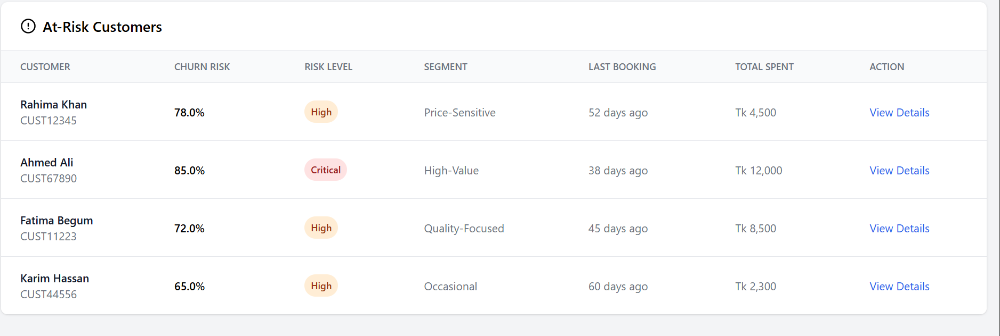

# Sheba Retention AI - Dashboard

A React-based dashboard for customer churn prediction and retention management with AI-powered SHAP explainability.




---

## 📋 Table of Contents

- [Prerequisites](#prerequisites)
- [Installation Guide](#installation-guide)
- [Running the Project](#running-the-project)
- [Project Structure](#project-structure)
- [Features](#features)
- [Testing with Mock Data](#testing-with-mock-data)
- [Connecting to Backend](#connecting-to-backend)
- [Troubleshooting](#troubleshooting)

---

## 🔧 Prerequisites

Before you start, you need to install these tools on your computer:

### 1. **Node.js** (Required)

Node.js is a JavaScript runtime that allows you to run React applications.

- **Download**: https://nodejs.org/
- **Version Required**: 16.0.0 or higher
- **Recommended**: Download the **LTS (Long Term Support)** version

**Installation Steps:**
1. Go to https://nodejs.org/
2. Click on the green button that says "LTS"
3. Download and run the installer
4. Follow the installation wizard (just click "Next" for everything)
5. Restart your computer after installation

**Verify Installation:**
Open Command Prompt (Windows) or Terminal (Mac/Linux) and type:

```bash
node --version
```

You should see something like: `v18.17.0` or higher

```bash
npm --version
```

You should see something like: `9.6.7` or higher

### 2. **Code Editor** (Recommended)

- **Visual Studio Code (VS Code)**: https://code.visualstudio.com/
- It's free and works on Windows, Mac, and Linux

### 3. **Git** (Optional but recommended)

- **Download**: https://git-scm.com/
- Used to clone the project from repositories

---

## 📦 Installation Guide

Follow these steps **exactly** to set up the project on your computer:

### Step 1: Get the Project Files

**Option A: If you have the project folder**
- Just copy the `sheba-dashboard` folder to your computer

**Option B: If using Git**
```bash
git clone <repository-url>
cd sheba-dashboard
```

### Step 2: Open the Project Folder

1. Open Command Prompt (Windows) or Terminal (Mac/Linux)
2. Navigate to the project folder:

```bash
cd path/to/sheba-dashboard
```

Example for Windows:
```bash
cd D:\Projects\sheba-dashboard
```

Example for Mac/Linux:
```bash
cd ~/Projects/sheba-dashboard
```

### Step 3: Install All Dependencies

This command will download and install all required packages (React, Tailwind CSS, etc.):

```bash
npm install
```

**What gets installed:**
- React 18.3.1
- Tailwind CSS 3.4.1
- Recharts (for charts)
- Axios (for API calls)
- Lucide React (for icons)
- And other dependencies

**This may take 2-5 minutes depending on your internet speed.**

You'll see a lot of text scrolling - that's normal! Wait until you see:

```
added 1500 packages in 3m
```

---

## 🚀 Running the Project

### Start the Development Server

Once installation is complete, run:

```bash
npm start
```

**What happens next:**
1. The terminal will show "Starting the development server..."
2. Your default web browser will automatically open
3. You'll see the dashboard at: `http://localhost:3000`

**If the browser doesn't open automatically:**
- Manually open your browser
- Go to: http://localhost:3000

### You should see:
- Dashboard with KPI cards showing customer metrics
- A table of at-risk customers
- Charts showing segment distribution
- Everything styled with a modern UI

---

## 📁 Project Structure

```
sheba-dashboard/
├── node_modules/          # Installed packages (auto-generated)
├── public/                # Public assets
│   └── index.html
├── src/                   # Source code
│   ├── components/        # React components
│   │   ├── KPICards.jsx          # Dashboard metrics cards
│   │   ├── ChurnTable.jsx        # At-risk customers table
│   │   ├── SegmentChart.jsx      # Pie chart
│   │   ├── CustomerModal.jsx     # Customer detail popup
│   │   ├── ShapExplanation.jsx   # AI explanations
│   │   ├── ErrorBoundary.jsx     # Error handling
│   │   └── LoadingSkeleton.jsx   # Loading states
│   ├── services/          # API and data services
│   │   ├── api.js                # Backend API integration
│   │   └── mockData.js           # Test data
│   ├── utils/             # Helper functions
│   │   └── helpers.js
│   ├── App.js             # Main dashboard
│   ├── index.js           # App entry point
│   └── index.css          # Tailwind CSS styles
├── .env                   # Environment variables
├── package.json           # Project dependencies
├── tailwind.config.js     # Tailwind configuration
└── README.md              # This file
```

---

## ✨ Features

### 1. **Dashboard Overview**
- Total customers count
- At-risk customers count
- Critical risk alerts
- Current retention rate

### 2. **Customer Risk Table**
- View all high-risk customers
- Sort by churn probability
- Click any customer to see details

### 3. **SHAP Explainability** (AI Explanations)
- See why each customer is at risk
- Top 3 factors contributing to churn
- Visual impact bars

### 4. **Intervention Recommendations**
- AI-suggested actions for each customer
- Personalized discount offers
- ROI predictions

### 5. **Customer Segmentation**
- Visual pie chart of customer segments
- Segment characteristics

---

## 🧪 Testing with Mock Data

By default, the dashboard uses **mock (fake) data** so you can test it without a backend.

### How to Enable Mock Data:

1. Open the `.env` file in the project root
2. Make sure it looks like this:

```bash
# Use mock data for testing
REACT_APP_USE_MOCK=true

# Backend URL (not used when mock is enabled)
REACT_APP_API_URL=http://localhost:8000/api
```

3. Save the file
4. Restart the app:
   - Press `Ctrl + C` in the terminal to stop
   - Run `npm start` again

**You'll see test data for:**
- 10,000 mock customers
- 127 at-risk customers
- Sample churn predictions
- Demo interventions

---

## 🔌 Connecting to Backend

Once your backend teammate has the API ready:

### Step 1: Update `.env` file

```bash
# Disable mock data
REACT_APP_USE_MOCK=false

# Set your backend URL
REACT_APP_API_URL=http://localhost:8000/api
```

**For production backend:**
```bash
REACT_APP_USE_MOCK=false
REACT_APP_API_URL=https://your-backend.railway.app/api
```

### Step 2: Restart the app

```bash
# Stop the server (Ctrl + C)
# Start again
npm start
```

### Step 3: Verify Connection

Open browser console (F12) and check for API calls. You should see:
- ✅ No "Using mock data" messages
- ✅ Actual API requests to your backend

---

## 🛠️ Troubleshooting

### Problem: "npm: command not found"

**Solution:** Node.js is not installed or not in PATH
1. Install Node.js from https://nodejs.org/
2. Restart your terminal/computer
3. Verify: `node --version`

---

### Problem: Port 3000 already in use

**Error:** `Something is already running on port 3000`

**Solution:**
- Option 1: Close other apps using port 3000
- Option 2: Run on different port:
  ```bash
  # Windows
  set PORT=3001 && npm start
  
  # Mac/Linux
  PORT=3001 npm start
  ```

---

### Problem: "Module not found" errors

**Solution:** Dependencies not installed properly
```bash
# Delete node_modules and reinstall
rm -rf node_modules package-lock.json
npm install
```

**Windows PowerShell:**
```powershell
Remove-Item -Recurse -Force node_modules
Remove-Item package-lock.json
npm install
```

---

### Problem: Tailwind styles not working

**Solution:** 
1. Check `src/index.css` has these lines:
   ```css
   @tailwind base;
   @tailwind components;
   @tailwind utilities;
   ```

2. Verify `tailwind.config.js` exists in root folder

3. Restart dev server:
   ```bash
   npm start
   ```

---

### Problem: Blank white screen

**Solution:**
1. Open browser console (Press F12)
2. Check for error messages
3. Common fixes:
   - Clear browser cache (Ctrl + Shift + Delete)
   - Try incognito/private mode
   - Check `.env` file is configured correctly

---

### Problem: API connection fails

**Symptoms:** Dashboard shows but no data loads

**Solution:**
1. Check if backend is running (ask your backend teammate)
2. Verify `.env` has correct `REACT_APP_API_URL`
3. Test backend directly: Open `http://localhost:8000/docs` in browser
4. Enable mock data temporarily:
   ```bash
   REACT_APP_USE_MOCK=true
   ```

---

## 📱 Browser Support

This dashboard works best on:
- ✅ Chrome (recommended)
- ✅ Firefox
- ✅ Safari
- ✅ Edge

**Minimum screen resolution:** 1280x720

---

## 🔄 Common Commands

```bash
# Install dependencies
npm install

# Start development server
npm start

# Build for production
npm run build

# Run production build locally
npm install -g serve
serve -s build

# Clear cache and reinstall
npm cache clean --force
rm -rf node_modules package-lock.json
npm install
```

---

## 📊 Tech Stack

| Technology | Version | Purpose |
|------------|---------|---------|
| React | 18.3.1 | UI Framework |
| Tailwind CSS | 3.4.1 | Styling |
| Recharts | 2.x | Charts & Graphs |
| Axios | 1.x | API Calls |
| Lucide React | 0.263.1 | Icons |
| Node.js | 16+ | Runtime |

---

## 👥 Team Coordination

### For Frontend Developers (You):
- Focus on UI components and user experience
- Test with mock data first
- Use placeholder APIs documented in `src/services/api.js`

### For Backend Developers:
- See `BACKEND_INTEGRATION.md` for API specifications
- All endpoints are documented with expected request/response formats
- CORS must be enabled for `http://localhost:3000`

---

## 📞 Need Help?

### Quick Checklist:
1. ✅ Node.js installed? (`node --version`)
2. ✅ Dependencies installed? (`npm install` completed)
3. ✅ `.env` file configured?
4. ✅ Server running? (`npm start`)
5. ✅ Browser opened to `http://localhost:3000`?

### Still stuck?
1. Check the **Troubleshooting** section above
2. Look for error messages in terminal
3. Check browser console (F12 → Console tab)
4. Ask your team lead or backend developer

---

## 🎉 Success Indicators

You'll know everything works when you see:

✅ Terminal shows: `webpack compiled successfully`  
✅ Browser shows styled dashboard with gradient header  
✅ KPI cards display numbers  
✅ Customer table is visible  
✅ Clicking a customer opens a modal  
✅ Charts render properly  
✅ No red errors in browser console (F12)  

---

## 📝 Notes

- **Mock data is enabled by default** - perfect for testing UI without backend
- **All API endpoints are documented** in `src/services/api.js`
- **Environment variables** are in `.env` - never commit this file to Git
- **Responsive design** - works on desktop, tablet, and mobile

---

## 🚀 Ready to Deploy?

See `DEPLOYMENT.md` for instructions on deploying to:
- Vercel (recommended)
- Netlify
- Railway

